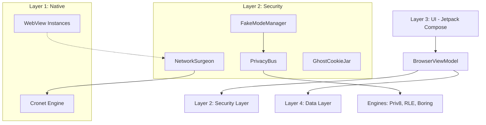

# JusBrowse: Technical Documentation

## 1. Overview
JusBrowse is a high-security, privacy-focused Android web browser built with Jetpack Compose. It is designed to be a "Stealth-First" browser, employing advanced techniques typically found in anti-detect browsers or cybersecurity research tools to protect user identity and prevent fingerprinting.

---

## 2. System Architecture
JusBrowse follows a multi-layered architectural pattern to separate UI, business logic, and security enforcement.

---

## 3. Core Features & Capabilities

### 🛡️ Deep Privacy Protection
*   **Fake Mode & Personas**: Users can select "Golden Profiles" (e.g., Pixel 8 Pro, Galaxy S24 Ultra). JusBrowse then spoofs every identifiable metric (User-Agent, Screen Size, Battery Level, GPU Renderer, CPU Cores, RAM) to match that profile perfectly.
*   **Fingerprinting Protection**: Dynamic JS injection intercepts and "glows" sensitive APIs (Canvas, AudioContext, WebRTC, Client Hints) to prevent tracking while maintaining site functionality.
*   **Network Interception (Network Surgeon)**: Bypasses the default (leaky) WebView network stack for standard requests. It strips tracking headers (like `x-goog-visitor-id`) and enforces HTTPS-only.
*   **Ghost Cookie Jar**: Implements per-container/per-tab cookie isolation. Cookies from one site or container never leak to another.
*   **Bridge Randomization**: The JavaScript bridges used for communication between the web and native layers are randomized per session, making it impossible for sites to detect the browser's presence by looking for specific JS objects.

### 🚀 Performance & Connectivity
*   **Cronet Integration**: Uses the Chromium network stack (Cronet) for native requests, enabling QUIC and HTTP/3 support for faster page loads.
*   **DNS-over-HTTPS (DoH)**: All DNS queries are routed through secure, encrypted providers (like Cloudflare or Quad9) directly via the native network layer.
*   **Container Isolation**: Each persona runs with its own data directory suffix, ensuring OS-level isolation of cache, cookies, and local storage.

### 🎨 Premium User Experience
*   **Freeform Workspace**: A desktop-like multi-view mode where tabs appear as draggable, resizable windows.
*   **Airlock Media System**: A powerful media extractor that pulls images, videos, and audio from any page into a clean, glassmorphic gallery for viewing or downloading.
*   **Glassmorphism UI**: High-fidelity interface using translucency, blur effects, and smooth animations (Material 3 Expressive).
*   **Sticker Start Page**: A customizable home screen where users can add interactive widgets and shortcuts.

---

## 4. How It Works (Technical Deep-Dive)

### 🩺 Network Surgeon & Interception
The `NetworkSurgeon` object acts as a bridge. When a `WebView` requests a resource, the `shouldInterceptRequest` hook in `SecureWebChromeClient` (or handled via `TabWindow`) passes the request to the Surgeon.
1.  **Surgery**: The Surgeon strips non-essential or tracking headers.
2.  **Disguise**: It adds persona-consistent headers (Client Hints, User-Agent).
3.  **Execution**: It executes the request using `OkHttpClient` (backed by `Cronet`).
4.  **Isolation**: It uses the `GhostCookieJar` to ensure cookies are container-specific.

### 🎭 Privacy Bus & Engines
When a page loads, JusBrowse injects a sophisticated protection script generated by `FakeModeManager` via the `PrivacyBus`.
*   **Priv8 Engine**: Flattens real device data into generic "buckets" (e.g., rounding screen size to standard increments).
*   **RL Engine (RLE)**: "Glows" the flattened data by applying the selected Persona's characteristics.
*   **Boring Engine**: Provides a stable, low-entropy identity for standard protection without a full persona.
*   **Surgical Injection**: Use of `Mulberry32` deterministic PRNG ensures that noise added to Canvas or Audio APIs is stable for the session, avoiding "suspicious jitter."

### 📂 Data Isolation
JusBrowse utilizes `WebView.setDataDirectorySuffix(id)`. This is a critical feature that forces the OS to create a completely separate file system silo for each Persona. History and Bookmarks are stored in a Room database (`BrowserDatabase`), which is also partitioned by Persona ID.

---

## 5. Security Protocols
*   **Stealth Mimicry**: Never uses "fixed" values that are easily flaggable. Instead, it mimics real device variance.
*   **No-Telemetry Policy**: 100% offline-first. No analytics or tracking data ever leaves the device.
*   **HTTPS Enforcement**: Hard-coded redirects for insecure connections at the interception layer.
*   **POST Body Sanitization**: Intercepts and cleanses outgoing POST payloads to prevent data exfiltration via hidden forms.

---

## 6. Glossary of Components
*   **`TabWindow.kt`**: Manages the individual WebView instances and their UI lifecycle.
*   **`FreeformWorkspace.kt`**: Implements the drag-and-drop multi-view window logic.
*   **`AirlockGallery.kt`**: The UI for viewing extracted media.
*   **`PrivacyBus.kt`**: The central coordinator for data "glow" and flattening.
*   **`DownloadReceiver.kt`**: Monitors downloads and performs security validation on completion.
